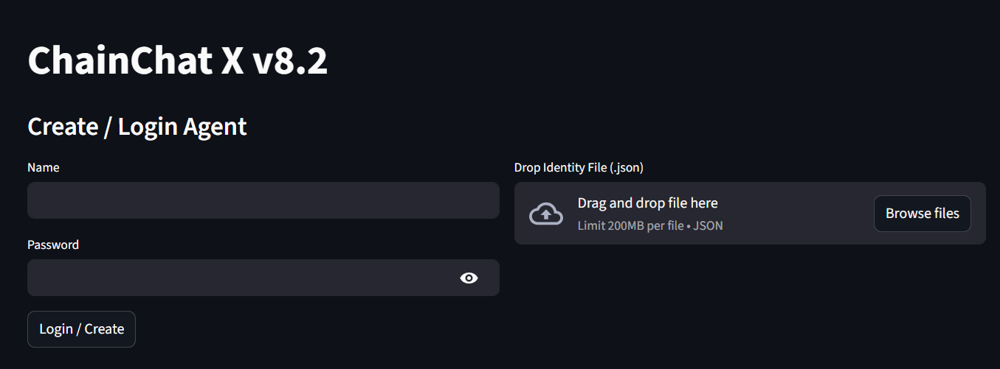
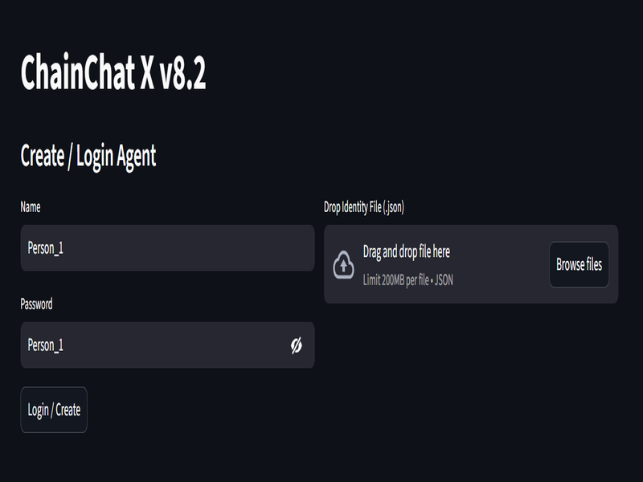
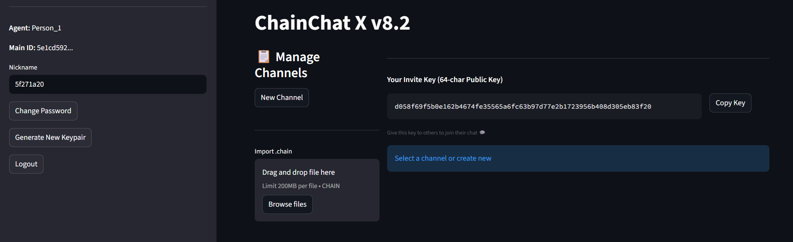
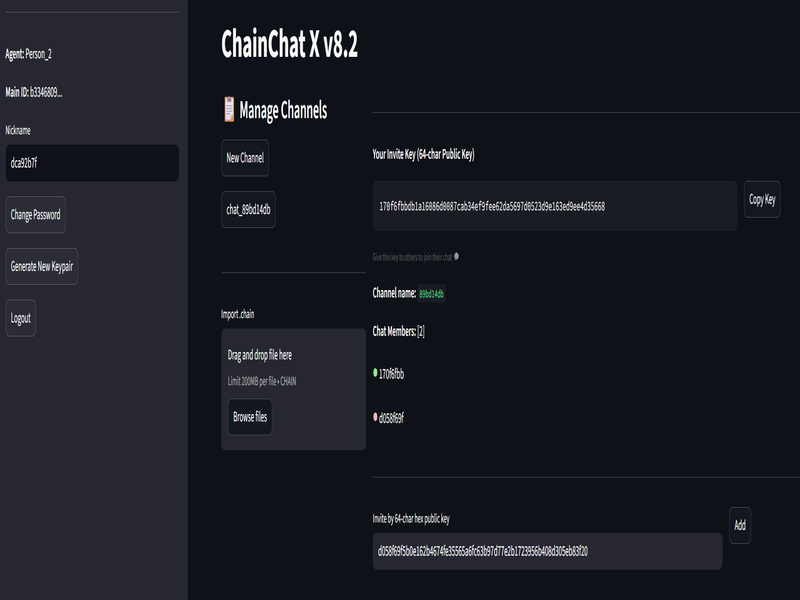
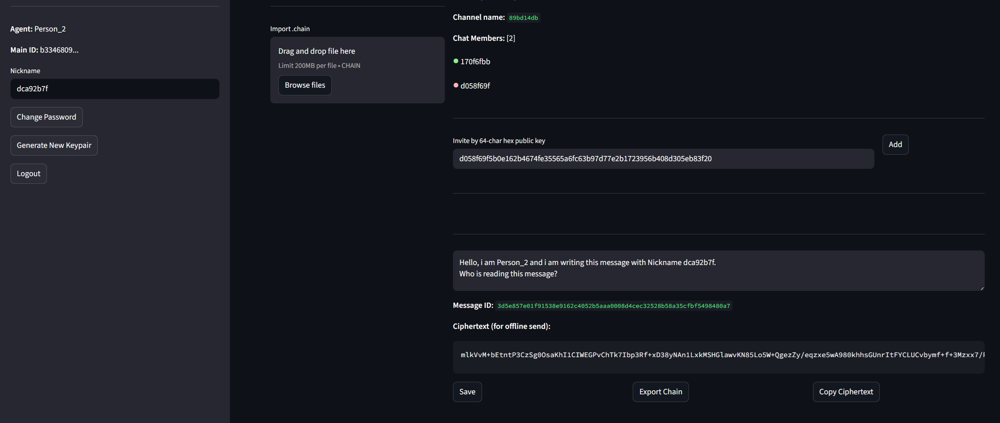
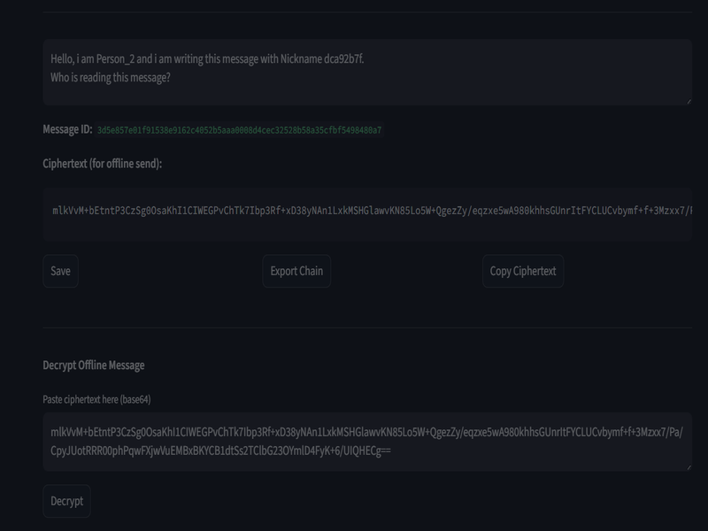
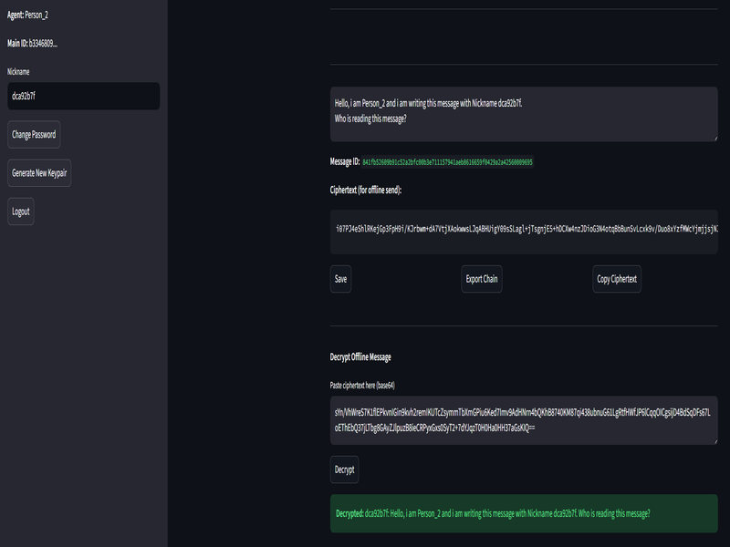

# Juanquavious-Crypto-Chain-Chat-X
Juanquavious Crypto Chain Chat X: an offline encripted chat app based on enc-key mix.

```bash
chainchat/
├── app.py              # Main entry — runs everything
├── import.py           # Auto-upgrade deps
├── verify_settings.py  # Auto-create project folders
├── crypto.py           # E2EE + hashing
├── `users/`            *(`local only`)* #folder with private keys used for login
└── `chains/`           *(`local only`)* #folder with encripted chats
```

## License

[MIT](https://choosealicense.com/licenses/mit/)

[Open-Source Juanquavious-Crypto-Chain-Chat-X](https://github.com/Rasp-pvtora/Juanquavious-Crypto-Chain-Chat-X/blob/main/LICENSE)

## Installation
In order to run the software, **Python should be installed on the machine.**!

Download the complete repository from terminal or directly the [github repository link](https://github.com/Rasp-pvtora/Juanquavious-Crypto-Chain-Chat-X.git)
```bash
git clone https://github.com/Rasp-pvtora/Juanquavious-Crypto-Chain-Chat-X.git
```

The app.py will automatically check for the required libraries, but is recommended to run the import.py for the first time:
```bash
py -m import.py
```

## Run Juanquavious-Crypto-Chain-Chat-X
Open the terminal, navigate to your folder and type:
```bash
py -m streamlit run app.py
```

## Login
At this point the [localhost streamlit webpage](http://localhost:8501/) at the port 8501 will open automatically.
The first page is the Login page.



Is possible to import an existing login authentification key (or *drag&drop*) or create a new user.
In this case we create a new user called **"Person_1"**



A new file inside the folder ***"users"*** will be created.
**This is the private key and should be NEVER shared. If the key is lost is not possible to open the corresponding chats anymore!**


## Main page



On the right side is possible to read the account information. Is also possible to **modify the "Nickname"** or you can leave the pseudo-nickname automatically generated. This is the Nickname used to sign the messages inside the chat.
The other user inside the chat will read your message and your Nickname (if you want to remain anonymous the best is to leave a pseudo-nickname).
The left side is for manage the Chats. Is possible to **import an existing chat file** (.chain) or create a new chat.
The **64-char pubblic key** has to be shared to create a new Chat. Each person will have an unique pubblic key
In this example will be

```bash
d058f69f5b0e162b4674fe35565a6fc63b97d77e2b1723956b408d305eb83f20
```

## Create a new chat
To create a new chat first of all is necessary to press on the button "**New Channel**" and then is necessary to enter the 64-char pubblic key of all the members that are authorised to read and write inside the chat.

In this example, we create a new user called **"Person_2"** and he will create the chat between **"Person_1 ↚ ↛  Person_2"**.
Person_1 share with Person_2 the 64-char pubblic key:
```bash
"64-char Pubblic Key Person_1:" d058f69f5b0e162b4674fe35565a6fc63b97d77e2b1723956b408d305eb83f20
```

As is possible to see in the next screenshot, Perosn_2 has a completely different pubblic key:
```bash
"64-char Pubblic Key Person_2:" 170f6fbbdb1a16086d0087cab34ef9fee62da5697d0523d9e163ed9ee4d35668
```


***(scrennshot above)*** Person_2 creates a new channel (click on the button "New Channle") and will add Person_1 to the chat: 



In the information channel section is possitle to read
```bash
"Channel name:" 89bd14db
"Chat Members:" 2
170f6fbb
d058f69f
```

This means that the chat is called ***89bd14db*** and 2 people are invited in the conversaiton: ***170f6fbb*** and ***d058f69f***.


## Write a new message inside the chat
At this point is possible to write a new message inside the chat:



```bash
"Hello, i am Person_2 and i am writing this message with Nickname dca92b7f.
Who is reading this message?"
```

below the encripted message will appear:

```bash
mlkVvM+bEtntP3CzSg0OsaKhI1CIWEGPvChTk7Ibp3Rf+xD38yNAn1LxkMSHGlawvKN85Lo5W+QgezZy/eqzxe5wA980khhsGUnrItFYCLUCvbymf+f+3Mzxx7/Pa/CpyJUotRRR00phPqwFXjwVuEMBxBKYCB1dtSs2TClbG23OYmlD4FyK+6/UIQHECg==
```



Now is possible to Save the encripted message inside the Chat file.
The file is located automatically inside the folder "**chains**".
When the button **Save** is pressed, the encripted chat file inside the chain folder is overwritten.
Pressing the button *Export* the file is downloaded in Download folder.

Give this file to the other person (via email, whatsapp, signal, social media) to the other person.
You can also copy the file inside chains folder!
The other person now has to import the chat file to read!

**A complete anonymouse offline software!!**

## Encription logic
Everytime a new char is typed inside teh Message Box a new unique hash value is generated and used to encript the message mixing all members private key. Since the code always run, each time a new button is pressed, the encripted message will change!

Is easy to see!
Open the chat and type anything! Each time you change your message the "**Message Hash ID**" and the "**Encription Message**" are changing.
Also if you press any button! If you press the button "Save" or "Export Chain" the encription message will always change!


You can also try to decript the encripted message, you will see that you have the same result!



## Offline chat communication
As already explained in the previous point, the person involved in the chat have to exchange physically the .chain file!
This file should be given to the other person via USB or via another online app (socail media, email, whatsapp, ... proton email).

Only the person with the private key can open the chat file and decript the messages inside.
This because inside the encripted chat at the beginning are listed the public key of the members! and only the right private key can generate the right public key! **One Way encription!**
In order to read the encripted chat, the software checks if the private key used to login and to open the chat can generate one of the listed public key. If this operation is done successfully, than is possible to open the encripted chat, read the data inside and write a new message!


A **possible hacker attack** can be possible only brute forcing the private keys and try at least 1 of the listed public key! if the hacker finds 1 private key that correspond to the 1 listed public key, than the attacker has the right to read the chat and write me a message with the stolen key.

## Online chat communication
When the user is typing a new message, a new encripted hash is generated automatically! This is the **encripted message** and this is what is going to be written inside the encripted chat! But this message can be copied and send it directly to the other person.
Example via AI-VoiceAssistant, whatsapp message, Radio communication, encripted device communication, ...

The other person receives the message, just copy and paste (without file involved) and will decript the message.
The only limitation is: the file chat should exist! This because the encripted message depends on the public keys of all chat members!

## Chat Example
```bash
┌─────────────────┐ ┌───────────────────────────────────────────────┐
│  Channel List   │ │  Channel name: chat_abc                       │
│                 │ │  Chat Members: [2]                            │
│ ▸ chat_abc      │ │  • Andrea     (green)                         │
│ ▸ chat_xyz      │ │  • Michael    (blue)                          │
│                 │ │                                               │
│ [+] New Chat    │ │                                               │
└─────────────────┘ │  [Andrea]                                     │
│                 │ │  i am user 1, who are you?                    │
│ [+] Import Chat │ │  14:32                                        │
└─────────────────┘ │                                   [Michael]   │
                    │                   I am user 2, How are you?   │
                    │                                   14:33       │
                    │                                               │
                    │  Write new message:                           │
                    │  How are you? Are you at home?                │
                    │                                               │
                    │  Encrypted Hash: xyz789abc123def456...        │
                    │                                               │
                    │  [Save]     [Export]                          │
                    ┌───────────────────────────────────────────────┐
                    │                                               │
                    │  Decrypt Offline Message:                     │
                    │  [ xyz789abc123def456... ]        [Decrypt]   │
                    │  How are you? Are you at home?                │
                    └───────────────────────────────────────────────┘
```

